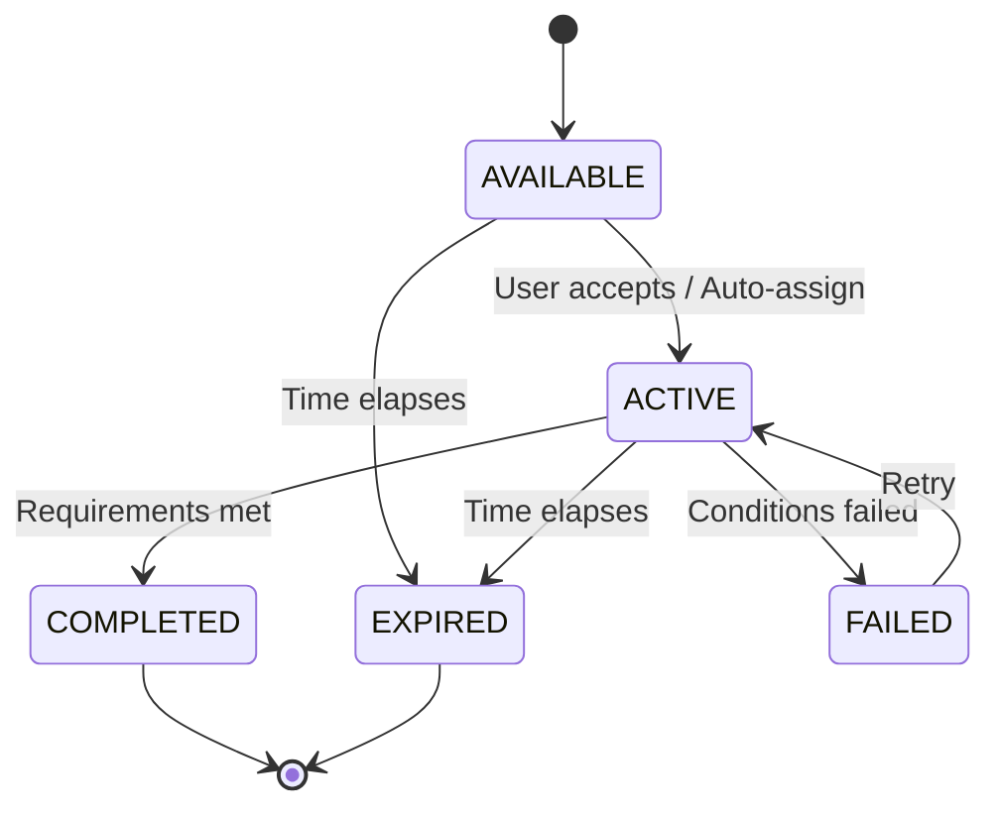

# Quest System State Machine Guide

## Overview
The BROski Bot Quest System uses a Finite State Machine (FSM) to manage the lifecycle of user quests. This ensures data integrity and enables AI-driven hooks at each stage.

## State Diagram

## States

| State | Description | AI Hooks |
|-------|-------------|----------|
| **AVAILABLE** | Quest is generated and ready for the user. | `QuestGenerator` creates personalized content. |
| **ACTIVE** | User is currently working on the quest. | `BehaviorAdapter` modifies descriptions/notifications. |
| **COMPLETED** | User has finished the quest successfully. | `AnalyticsEngine` analyzes performance; Rewards distributed. |
| **FAILED** | User failed to meet requirements (e.g., streak broken). | `BehaviorAdapter` offers encouragement/coaching. |
| **EXPIRED** | Quest duration has passed. | `AnalyticsEngine` logs missed opportunity. |

## AI Integration

### 1. Dynamic Generation (Entry to AVAILABLE)
The `QuestGenerator` service analyzes user history (level, play style, activity) to create custom quest templates.
- **Inputs**: User Profile, Recent Activity.
- **Outputs**: Quest Title, Description, Requirements, Rewards.

### 2. Adaptive Behavior (Entry to ACTIVE)
When a quest becomes active, the `BehaviorAdapter` may modify the flavor text to match the user's preferred tone (e.g., "Drill Sergeant" vs. "Cheerleader").

### 3. Predictive Analytics (Entry to COMPLETED/EXPIRED)
Upon completion, the `AnalyticsEngine` updates the user's churn risk score and suggests retention actions.

## Extension Points
To add new logic:
1. **Validation**: Update `QuestStateMachine.TRANSITIONS` in `src/core/quest_engine.py`.
2. **Hooks**: Implement `_on_enter_state` or `_on_exit_state` in `AgentOrchestrator`.
3. **Services**: Add new methods to `src/services/ai/`.
