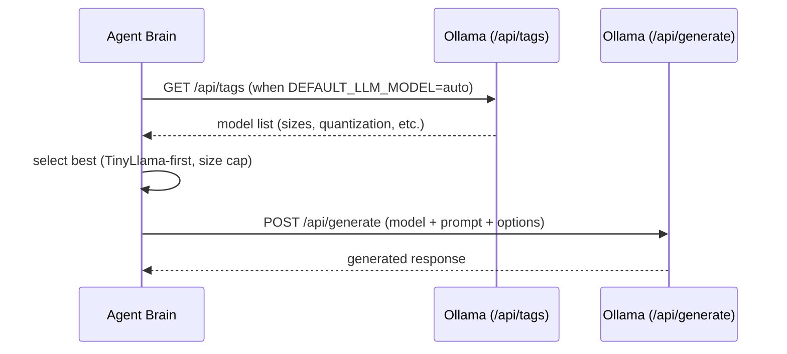

# HyperCode V2.0 — Repository Report

**Doc Tag:** v2.0.0 | **Last Updated:** 2026-03-10

[](https://github.com/welshDog/HyperCode-V2.0/actions/workflows/ci.yml)
[](https://github.com/welshDog/HyperCode-V2.0/actions/workflows/docker.yml)
[](https://github.com/welshDog/HyperCode-V2.0/actions/workflows/docs-lint.yml)
[](backend/app/core/config.py)
[](LICENSE)
[](CONTRIBUTING.md)

HyperCode V2.0 is a neurodivergent-first cognitive architecture: a Docker-packaged platform that ships a core FastAPI backend, a mission control dashboard, and an agent ecosystem designed to reduce cognitive load while keeping the system observable, testable, and safe by default.

## Table of Contents

- [Executive Summary](#executive-summary)
- [Recent Accomplishments & Milestones](#recent-accomplishments--milestones)
- [Architecture](#architecture)
- [Feature Deep Dives](#feature-deep-dives)
- [Performance Benchmarks](#performance-benchmarks)
- [Testing & Coverage](#testing--coverage)
- [Deployment Procedures](#deployment-procedures)
- [Visual Demonstrations](#visual-demonstrations)
- [Community & Governance](#community--governance)
- [Roadmap](#roadmap)
- [Acknowledgments](#acknowledgments)

## Executive Summary

HyperCode V2.0 focuses on a practical, reproducible developer experience for neurodivergent builders:

- **Local-first AI by default**: run safely on smaller models (TinyLlama) to avoid resource cliffs.
- **Modular platform**: core API, agents, and dashboard are independently testable and deployable.
- **Production-shaped dev**: Docker Compose profiles for agents/monitoring/production-like topologies.
- **Observability built-in**: metrics and tracing hooks (Prometheus + OpenTelemetry) for feedback loops.

## Recent Accomplishments & Milestones

### 1) Local LLM “safe default brain” (TinyLlama-first)

Aligned with [Goal for the agents.md](docs/notes/Goal%20for%20the%20agents.md), the default configuration now favors smaller models and predictable output structure.

- Default model selection now supports `DEFAULT_LLM_MODEL=auto` (choose best available small/quantized model)
- Agents default to TinyLlama host + lower temperature for reduced repetition and improved stability
- Tuning parameters exposed via env vars and wired into Ollama requests

Key implementation references:
- Backend model auto-selection: [ollama.py](backend/app/llm/ollama.py)
- Backend request routing + prompt shaping: [brain.py](backend/app/agents/brain.py)
- Configurable tuning surface: [config.py](backend/app/core/config.py#L21-L51)

### 2) Configuration + docs alignment across environments

- Docker Compose environment defaults updated to match TinyLlama-first behavior: [docker-compose.yml](docker-compose.yml)
- K8s config updated to reflect new defaults: [02-configmap.yaml](k8s/02-configmap.yaml) and [10-ollama.yaml](k8s/10-ollama.yaml)
- Agent config defaults standardized: example [agents/01-frontend-specialist/config.json](agents/01-frontend-specialist/config.json)

### 3) Reproducible tests for selection + tuning

- Unit tests verify selection ordering, size filtering, and caching: [test_ollama_model_selection.py](backend/tests/unit/test_ollama_model_selection.py)
- Optional integration test defines a measurable behavior improvement metric (repetition score): [test_ollama_tuning.py](backend/tests/integration/test_ollama_tuning.py)

## Architecture

### High-level system map (Docker-first)

```mermaid
flowchart LR
  user([User]) --> dash[Dashboard / Mission Control]
  dash --> api[HyperCode Core API (FastAPI)]
  api --> pg[(PostgreSQL)]
  api --> redis[(Redis)]
  api --> minio[(MinIO / S3)]
  api --> chroma[(ChromaDB)]
  api --> ollama[Ollama Model Runner]
  api --> agents[Agent Services]

  subgraph Observability
    prom[Prometheus]
    graf[Grafana]
    otel[OpenTelemetry]
  end

  api --> otel
  api --> prom
  prom --> graf
```

Primary docs:
- Platform overview: [ARCHITECTURE.md](ARCHITECTURE.md)
- Kubernetes guide: [DEPLOYMENT_GUIDE.md](DEPLOYMENT_GUIDE.md)

### Request path: Agent “brain” → Local LLM



## Feature Deep Dives

### Feature: Quantized model auto-selection (TinyLlama-first)

When `DEFAULT_LLM_MODEL=auto`, HyperCode selects the smallest model available under a configurable size limit and according to preferred patterns.

**Config surface (env):**
- `DEFAULT_LLM_MODEL=auto`
- `OLLAMA_MODEL_PREFERRED=tinyllama:latest,tinyllama,phi3:latest,phi3`
- `OLLAMA_MAX_MODEL_SIZE_MB=2500`
- `OLLAMA_MODEL_REFRESH_SECONDS=300`

**Code snippet (selection core):**

```python
def select_best_ollama_model(tags_payload: dict[str, Any], *, preferred_patterns: list[str], max_size_mb: int) -> str | None:
    ...
    candidates.sort(
        key=lambda c: (
            _preferred_rank(c.name, preferred_patterns),
            c.size_bytes or (1024**5),
            _quantization_rank(c.quantization_level),
            c.name,
        )
    )
    return candidates[0].name
```

**Inline explanation:**
- `_preferred_rank(...)` ensures TinyLlama is chosen whenever it exists.
- `c.size_bytes` pushes the selection toward smaller footprints under the cap.
- `_quantization_rank(...)` breaks ties by favoring smaller quantization levels (Q4 first).
- A short in-memory cache avoids frequent `/api/tags` calls.

References:
- Selector + resolver: [ollama.py](backend/app/llm/ollama.py)
- Brain integration: [brain.py](backend/app/agents/brain.py)

### Feature: Hyper-parameter tuning for predictable behavior

The system exposes Ollama generation options via environment variables and passes them through to `/api/generate`.

**Defaults (resource-safe + less repetition):**

```text
OLLAMA_TEMPERATURE=0.3
OLLAMA_TOP_P=0.9
OLLAMA_TOP_K=40
OLLAMA_REPEAT_PENALTY=1.1
OLLAMA_NUM_CTX=2048
OLLAMA_NUM_PREDICT=256
```

**Where options are assembled:**
- [ollama_generate_options](backend/app/core/config.py#L39-L50)

**Why this helps:**
- Lower temperature reduces chaotic sampling (more consistent responses).
- Repeat penalty discourages looping phrases common in small local models.
- `num_predict` bounds output to keep latency and token usage predictable.

### Feature: Agent response shape aligned to neurodivergent goals

The local LLM prompt is structured to:
- start with a 1–3 line TL;DR
- follow with headings + bullet points
- propose the next single step to reduce overwhelm

Reference: [brain.py](backend/app/agents/brain.py)

## Performance Benchmarks

### Reproducible benchmark runner

Benchmark script (prints latency + repetition score):
- [scripts/ollama_benchmark.py](scripts/ollama_benchmark.py)

Run:

```powershell
python scripts/ollama_benchmark.py
```

If Ollama is not reachable, the script returns a structured error instead of a traceback (example):

```text
{'error': 'ollama_unreachable', 'host': 'http://localhost:11434', 'hint': 'Start Ollama and ensure /api/generate is reachable', 'details': '[WinError 10061] ...'}
```

### Measurable “behavior improvement” metric

To validate tuning changes on real hardware, run the optional integration test:

```powershell
cd backend
$env:RUN_OLLAMA_BENCH="1"
python -m pytest -q tests/integration/test_ollama_tuning.py
```

The test compares a baseline config vs tuned config using a simple repetition-score heuristic:
- [test_ollama_tuning.py](backend/tests/integration/test_ollama_tuning.py)

## Testing & Coverage

### Backend test suite status

Current local run:
- `7 passed, 2 skipped`

Coverage:
- **Total**: **69%**
- LLM auto-selection module: **85%** ([app/llm/ollama.py](backend/app/llm/ollama.py))

Reproduce:

```powershell
cd backend
python -m pytest -q --cov=app --cov-report=term-missing
```

CI entry point:
- [ci.yml](.github/workflows/ci.yml)

## Deployment Procedures

### Docker Compose (recommended for local dev)

Quick start:

```powershell
docker compose up -d
docker compose --profile agents up -d
docker compose --profile monitoring up -d
```

Health checks:
- Core: `http://localhost:8000/health`
- Orchestrator: `http://localhost:8081/health`
- Dashboard: `http://localhost:8088/`

More details:
- [CONTRIBUTING.md](CONTRIBUTING.md)
- [TROUBLESHOOTING.md](TROUBLESHOOTING.md)

### Kubernetes (cluster deployment)

Primary guide:
- [DEPLOYMENT_GUIDE.md](DEPLOYMENT_GUIDE.md)

Key manifests:
- App ConfigMap: [k8s/02-configmap.yaml](k8s/02-configmap.yaml)
- Ollama StatefulSet: [k8s/10-ollama.yaml](k8s/10-ollama.yaml)

## Visual Demonstrations

### Cognitive Architecture diagram (project asset)


### Mission Control dashboard screenshots (project assets)


### Grafana dashboard examples (project assets)


## Community & Governance

### Contributing

- Guidelines: [CONTRIBUTING.md](CONTRIBUTING.md)
- Recommended commit style: Conventional Commits (`feat:`, `fix:`, etc.)

### Security & safety

- License: AGPL-3.0 ([LICENSE](LICENSE))
- Local-first default LLM reduces dependency on external APIs by default.

## Roadmap

Near-term, community-friendly targets:

- Publish “hyperfocus-team” agent config artifact and registry workflow
- Expand coverage for worker, RAG, and auth flows
- Ship a small set of golden-path demos (GIFs) for onboarding
- Add evaluation harness (prompt regression tests) for agent behaviors
- Provide a reproducible “low-memory mode” profile for Ollama + agents

## Acknowledgments

- **welshDog / Lyndz Williams** — creator and maintainer
- Community contributors — thank you for testing, filing issues, and sharing feedback
