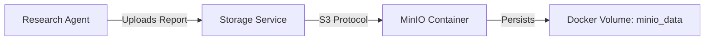

# ☁️ MinIO Integration Guide

## Overview
HyperCode V2.0 uses **MinIO** as a high-performance, S3-compatible object storage system. It serves as the **Long-Term Memory** for the agent swarm, storing research reports, generated code artifacts, and large datasets that don't fit in a traditional database.

## Architecture



## Configuration

The storage service is configured via environment variables in `.env`:

```bash
MINIO_ENDPOINT=http://minio:9000
MINIO_ACCESS_KEY=minioadmin
MINIO_SECRET_KEY=minioadmin
MINIO_BUCKET_REPORTS=agent-reports
```

## Usage

### In Agents
Agents can use the global `storage` instance to upload files easily:

```python
from app.core.storage import storage

def save_report(content: str, filename: str):
    # Automatically handles retry logic and bucket creation
    url = storage.upload_file(content, filename)
    return url
```

### Accessing Data
You can view and manage stored objects via the **MinIO Console**:
*   **URL**: `http://localhost:9001`
*   **User**: `minioadmin`
*   **Password**: `minioadmin`

## Troubleshooting
*   **Connection Refused**: Ensure the `minio` container is running (`docker ps`).
*   **Access Denied**: Verify `MINIO_ACCESS_KEY` and `MINIO_SECRET_KEY` match your `.env` file.
*   **Bucket Not Found**: The `StorageService` automatically creates buckets on startup. Check `backend` logs for initialization errors.

## Verification
To verify the integration is working, run the test script inside the container:

```bash
docker exec celery-worker python /app/verify_minio.py
```
