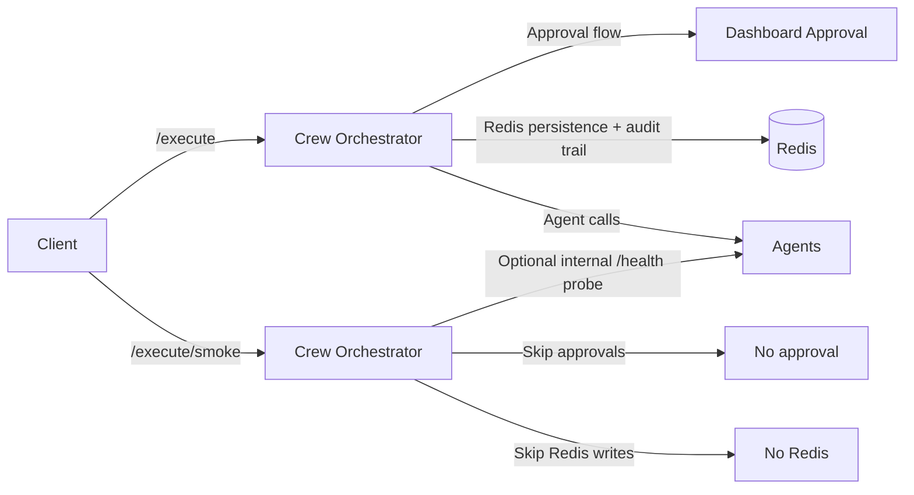

# ⚡ /execute/smoke Endpoint — Complete Implementation Plan (Benchmark + Phase 3 Validation Only)

This endpoint is a benchmark-only / Phase 3 validation-only probe designed for “hyper-performance”:
- Bypasses all approval workflows
- Eliminates all Redis task-history writes
- Preserves `/execute` as the strict + auditable production path



---

## Agent Help (Best Agents on the Job)

| Agent | Ownership for this endpoint |
|------|------------------------------|
| 🏗️ System Architect | Defines endpoint contract + safety model |
| 🔒 Security Engineer | Designs allowlist keys + TTL revocation policy |
| 🛠️ DevOps Engineer | Bench harness + internal-only rollout strategy |
| ✅ QA Engineer | Test matrix: bypass validation + “no audit leakage” |
| 🧠 Backend Specialist | FastAPI/Pydantic schemas + perf-safe implementation |

---

## (1) Exact Route + Schemas

### Route
- HTTP method: `POST`
- Path: `/execute/smoke`

### Mandatory headers
- `X-Smoke-Mode: true`
- `X-API-Key: <benchmark-key>`

### Request schema

```python
from pydantic import BaseModel, Field
from typing import Literal, Optional

class SmokeRequest(BaseModel):
    mode: Literal["noop", "probe_health"] = Field(default="noop")
    agent: Optional[str] = Field(default=None)
```

### Response schema

```python
from pydantic import BaseModel
from typing import Any, Dict, Optional

class SmokeResponse(BaseModel):
    smoke: str
    mode: str
    latency_ms: float
    redis_writes_skipped: int
    approval_skipped: bool
    agent: Optional[str] = None
    agent_http_status: Optional[int] = None
    agent_latency_ms: Optional[float] = None
    timestamp: str
    meta: Dict[str, Any] = {}
```

### Copy/paste requests

```powershell
curl.exe -X POST http://127.0.0.1:8081/execute/smoke `
  -H "Content-Type: application/json" `
  -H "X-Smoke-Mode: true" `
  -H "X-API-Key: BENCH_KEY_HERE" `
  -d "{""mode"":""noop""}"
```

```powershell
curl.exe -X POST http://127.0.0.1:8081/execute/smoke `
  -H "Content-Type: application/json" `
  -H "X-Smoke-Mode: true" `
  -H "X-API-Key: BENCH_KEY_HERE" `
  -d "{""mode"":""probe_health"",""agent"":""project-strategist""}"
```

---

## (2) Middleware / Workflow Differences (Skipped vs Retained)

### Retained security checks
- Authentication dependency `require_api_key`
- Input validation via Pydantic
- Smoke guardrails: `X-Smoke-Mode: true` + benchmark key allowlist + TTL policy

### Skipped workflows (must be zero)
- Approval flow (`request_approval`)
- Redis persistence (`task:*`, `tasks:history`)
- Redis log writes (`logs:global`)
- Redis approval pub/sub (`approval_requests`)
- Agent busy tracking (`agent:*:current_task`)

### Rate limiting
- If/when rate limiting is added, `/execute/smoke` must be in a separate benchmark bucket or excluded.

---

## (3) Performance Success Criteria (Hard Targets)

- NOOP mode must achieve:
  - ≤ 20 ms p99 latency
  - ≥ 10,000 RPS throughput on 4-core bench hardware

Implementation rules for NOOP:
- no Redis usage
- no approvals
- no outbound agent calls
- no per-request http client construction

---

## (4) Safety Guardrails (Mandatory)

### Feature flag
- `SMOKE_ENDPOINT_ENABLED=false` by default
- When disabled: return `404` (or `403`) and do nothing else

### Required header flag
- Must include `X-Smoke-Mode: true`

### Benchmark key allowlist (without committing secrets)
Allowlist must be hard-coded as SHA-256 hashes of benchmark keys (never store raw keys in git).

```python
import hashlib
from datetime import datetime
from fastapi import HTTPException, Request

BENCH_KEY_HASH_ALLOWLIST = {
    "REPLACE_WITH_REAL_HASH_1",
    "REPLACE_WITH_REAL_HASH_2",
}

SMOKE_KEY_TTL_SECONDS = 900
_issued: dict[str, datetime] = {}

def _hash_key(raw: str) -> str:
    return hashlib.sha256(raw.encode("utf-8")).hexdigest()

def enforce_smoke_guardrails(request: Request):
    if request.headers.get("x-smoke-mode") != "true":
        raise HTTPException(status_code=403, detail="Missing X-Smoke-Mode: true")

    raw_key = request.headers.get("x-api-key")
    if not raw_key:
        raise HTTPException(status_code=401, detail="Missing X-API-Key")

    key_hash = _hash_key(raw_key)
    if key_hash not in BENCH_KEY_HASH_ALLOWLIST:
        raise HTTPException(status_code=401, detail="Invalid benchmark key")

    now = datetime.utcnow()
    issued_at = _issued.get(key_hash)
    if not issued_at:
        _issued[key_hash] = now
        return

    if (now - issued_at).total_seconds() > SMOKE_KEY_TTL_SECONDS:
        _issued.pop(key_hash, None)
        raise HTTPException(status_code=401, detail="Benchmark key TTL expired")
```

---

## (5) Testing Matrix (Mandatory)

### Unit tests
- Feature flag off → endpoint not reachable
- Missing `X-Smoke-Mode` → 403
- Invalid/expired key → 401
- NOOP response returns `approval_skipped=true` and `redis_writes_skipped>=1`

### Integration tests (prove zero audit leakage)
- Call `/execute/smoke`
- Assert `GET /tasks` has no new entry
- Assert Redis task namespaces unchanged (`task:*`, `approval:*`, `tasks:history`)
- Assert `/execute` behavior unchanged (approval timeout stays ~60s when requires_approval=true and no approval response exists)

### Load tests (prove no Redis writes)
- Load NOOP mode and assert Redis does not receive `SET/LPUSH/PUBLISH` from smoke traffic

---

## (6) Rollout Plan (Mandatory)

### Feature flag
- `SMOKE_ENDPOINT_ENABLED` default false
- Enable only in internal benchmark + Phase 3 validation windows

### Dark launch (internal-only)
- Do not show in dashboard UI
- Enable only where Orchestrator is not exposed beyond localhost/internal segments

### Prometheus metrics (mandatory)
- `smoke_request_total`
- `smoke_redis_skip_total`

```python
from prometheus_client import Counter

smoke_request_total = Counter("smoke_request_total", "Total smoke requests", ["mode"])
smoke_redis_skip_total = Counter("smoke_redis_skip_total", "Redis writes skipped by smoke endpoint")
```

---

## (7) Rollback Procedure (Mandatory)

### One-line config revert
- Set `SMOKE_ENDPOINT_ENABLED=false` and restart the Orchestrator container.

### Immediate cache flush (prevent stale bypass behavior)
- The TTL issuance cache is in-memory; restart flushes it immediately.
- If any Redis smoke keys are introduced later (not recommended), delete only `smoke:*`:

```powershell
docker exec redis redis-cli --scan --pattern "smoke:*" | % { docker exec redis redis-cli del $_ }
```

---

## Implementation Location
- Implement in `agents/crew-orchestrator/main.py` immediately after `/execute`.
- `/execute` must remain strict and unchanged: approvals + Redis persistence + audit trail stay intact.
